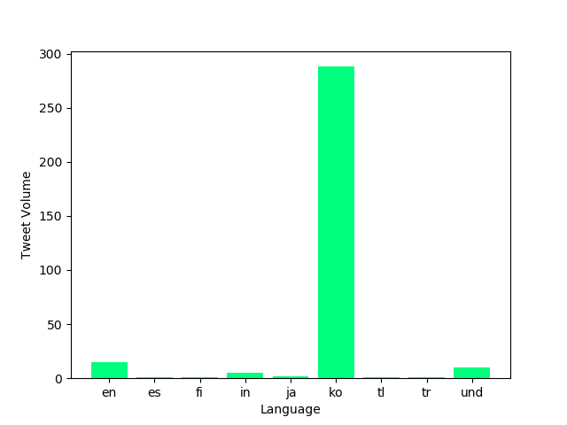

The goal of this project is to analyse all tweets sent in 2020. I used geotags in order to analyse these tweets meaning that the dataset is only a fraction of what was really sent and therefore can be considered only a sample of the tweets actually sent in 2020. The focus of this assignment was the COVID-19 pandemic and we used a series of tasks in order to achieve results that will be visualized below: 

Task 0: Creating the Mapper

First, I was given a map.py that maps and tracks the usage of hashtags. I had to modify and complete it so that it does so both on a language and country level. This file would thus generate a language and country dictionary.

Task 1: Running the Mapper

After completing my mapper function, I had to use a shell script that I created that would run each file in the dataset. Because the process could (and did) take longer than a day to run, I had to use the nohup command in order to ensure that it would still run while I was offline.

Task 2: Reduce

Once the mapper finished running and I had seen it had done it correctly, I used the reduce.py function in order to combine all language files into a single file and all country files into another, different file. Thus, a year's worth of days data was condensed into one single file. 

Task 3: Visualize

I then changed a provided visualize.py file to generate four bar graph and store them as png files. This visualize file used matplotlib to plot the data as suggested by the instructor: 

The first graph is the country distribution of #coronavirus:

The second graph is the language distribution of #coronavirus:

The third graph is the country distribution of #코로나바이러스 (which is Korean for #coronavirus):

The fourth graph is the language distribution of #코로나바이러스:

Task 4: Alternative Reduce

Lastly, I created another python file called alternative_reduce.py which takes any list of hashtags as its input and outputs a line plot with each line corresponding to the hashtag. I added a print statement with this python file so that it tells the user which files were not significant or not present on the dataset. For example, before running the graph with the hashtags seen below I tried using a few hashtags that were not present in the dataset. Perhaps, if we had access to all the tweets not only the geotagged one the result would have been different. I tried #flattenthecurve, #mask, #vaccine, and did not get significant results to report.

Nonetheless the script ran through all the data in my outputs folder and again used matplot lib to plot the following hashtags: #coronavirus, #flu, #covid-19

 
